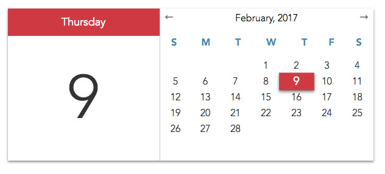

<p align='center'>
  
</p>

# A simple date-picker example
### Javascript only

Add a date picker to a page using

```javascript
var calendar = new Calendar('<your-div-base-element-id>');
```

get the current selected date using

```javascript
calendar.getDate();
```
